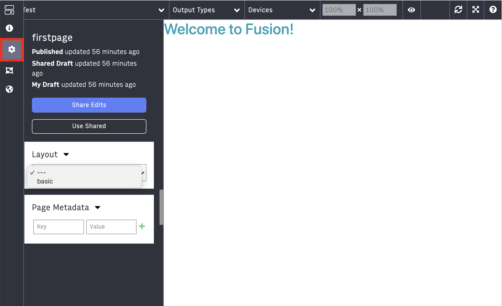
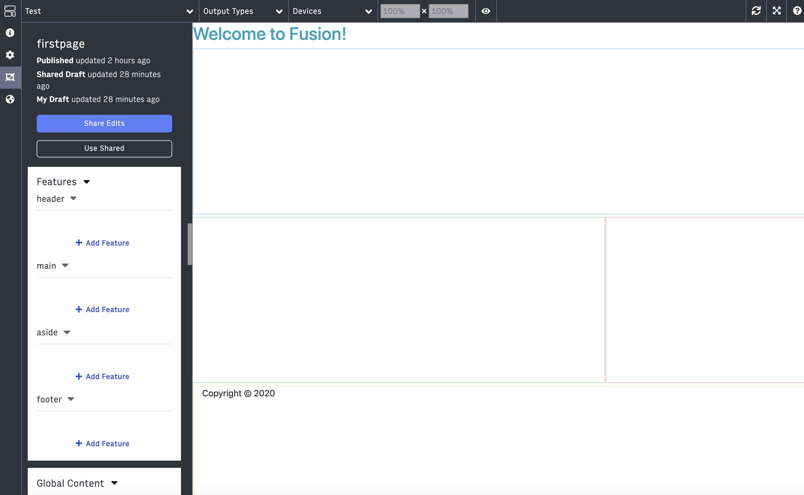

Nice work completing `lab-01`. If you are continuing this training from the last lab, then keep working on your current branch USERNAME-fusion-training. If you are starting this training from this branch, you will need to clone and set up this repository as described in `lab-00`.

## Lab 02
This lab focuses on layouts. You will create, implement, and add a layout to your page in PageBuilder Editor.

A layout gives a page some structure and semantic HTML. To learn more about layouts, [click here](https://redirector.arcpublishing.com/alc/arc-products/pagebuilder/fusion/documentation/recipes/creating-layout-component.md?version=2.6).

## Guide
1. All layouts are added to the `components/layouts` folder. Change directory into this folder and create a new file called `basic.jsx`

2. In `basic.jsx`, create a new functional React component called `BasicLayout` and make that the default export. We'll be using functional components during these labs, but class-based components are also supported.
    ```
    const BasicLayout = (props) => {
        return <></>
    };

    export default BasicLayout;
    ```

3. Lets define the following sections for this layout outside the definition of your component, like so:
    ```
    BasicLayout.sections = ['header', 'main', 'aside', 'footer'];
    ```

4. The content of all those sections will be passed via `props.children` in the component so let's retrieve those sections and add them to the return value:
    ```
    const [header, main, aside, footer] = props.children;

    return (
        <div>
            <div>
                <header className='col-lg-12 header'>
                    {header}
                </header>
                <div className="row">
                    <div className='col-md-8 main'>
                        {main}
                    </div>
                    <div className='col-md-4 aside'>
                        {aside}
                    </div>
                </div>
                <footer className='col-lg-12 footer'>
                    {footer}
                    <p>Copyright &copy; 2020</p>
                </footer>
            </div>
        </div>
    )
    ```

5. Define the propTypes of your component:
    ```
    BasicLayout.propTypes = {
    children: PropTypes.node,
    };
    ```
    To use PropTypes, you'll need to import the library into your component
    ```
    import PropTypes from 'fusion:prop-types';
    ```
    In general, using [PropTypes](https://github.com/facebook/prop-types) allows developers to mitigate the risk of passing the wrong data types to components. It does so by validating data types as they pass through components. 

6. Now, lets render these sections of the layout. Bootstrap or inline CSS can be used to give the layout some structure. 

    By now our `BasicLayout` and `styles` file should look like this:  

    ```
    import React from 'react';
    import './styles.scss';
    import PropTypes from 'prop-types';

    const BasicLayout = (props) => {

        const [header, main, aside, footer] = props.children;

        return (
            <div>
                <div>
                    <header className='col-lg-12 header'>
                        {header}
                    </header>
                    <div className="row">
                        <div className='col-md-8 main'>
                            {main}
                        </div>
                        <div className='col-md-4 aside'>
                            {aside}
                        </div>
                    </div>
                    <footer className='col-lg-12 footer'>
                        {footer}
                        <p>Copyright &copy; 2020</p>
                    </footer>
                </div>
            </div>
        )
    }

    BasicLayout.propTypes = {
        children: PropTypes.node
    }

    BasicLayout.sections = ['header', 'main', 'aside', 'footer'];

    export default BasicLayout; 
    ```
    <br/>

    styles.scss:

    ```
    .header {
        border: 2px solid #cce5ff;
        min-height: 300px;
        margin: 2px 0;
    }

    .main {
        border: 2px solid #d4edda;
        min-height: 500px;
        margin: 2px 0;
    }

    .aside {
        border: 2px solid #f8d7da;
        min-height: 500px;
        margin: 2px 0;
    }

    .footer {
        border: 2px solid #fff3cd;
        min-height: 300px;
        margin: 2px 0;
    }


7. Since we added a new file here, we have to restart or rebuild fusion to recognize it. You can manually restart or manually rebuild with `npx fusion rebuild`. Once fusion is back up, go into PageBuilder at `http://localhost/pagebuilder/pages` and open the page you had created in the previous lab.

8. Click on the `Setup` icon on the left and select your new layout. 
    
    Note: If you don't see your layout in the dropdown, try re-starting Fusion

    

    Then click on the `Curate` icon on the left and you should see all the new sections of your layout show up (header, main, aside, footer).

    

    Remember, if you would like to see the solution, you can always switch to the next lab branch.

## [Next up: Lab 03](https://github.com/wapopartners/Fusion-Training-User-Stories/tree/lab-03)
