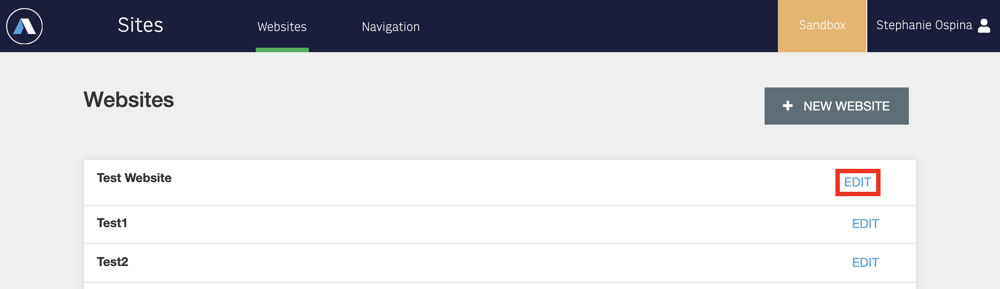
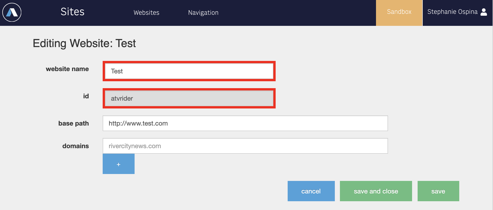

## Lab 00
In this lab you will setup your repository to run Fusion and PageBuilder editor locally.

1. Make sure you're on the branch `USERNAME-fusion-training` you created from `master` in the previous step.

2. Start fusion
    ```
    npx fusion start
    ```

3. Load the following link once fusion has finished loading (it might take a few minutes)
    ```
    http://localhost/pagebuilder/pages
    ```
    You should see this page

    

    ```diff
    - Note: you may see an alert warning of an error with content sources. Disregard this; we will address content sources later on.
    ```

4. Create a folder called `mocks` in the root of the repo if it doesn't exit. We need to create a few mock files to give your local user permissions as well as your local version of PageBuilder data of all the Sites that exist for your organization.

5. In `mocks`, add the file `/mocks/user` if it doesn't exist, with the following content:

    ```
    {
    "displayName": "Local Developer",
    "permissions": {
        "PageBuilder": {
        "global": [
            "W",
            "D",
            "P",
            "VRP",
            "ERP",
            "DT"
        ]
        }
    }
    } 
    ```

    Also add the file `/mocks/siteservice/api/v3/website` if it doesn't exist, with the following content.

    ```
    [
    {
        "_id": "demo",
        "display_name": "Demo",
        "is_default_website": true
    }
    ]
    ```
    NOTE: if you have a site set up in your organizations [Arc environment](https://redirector.arcpublishing.com/siteservice), update the `_id` and `display_name` value with that site's values. Follow these steps in site service to get your site's information.

    
    <br/><br/>
    


6. Open the file called `.env` from the root of your project directory. Remove the `#` so that the lines are no longer commented out. Leave `FUSION_RELEASE` as is. You will need to update the content base and add an access token for your API through the following steps:
    - Go to your orgs Arc homepage and switch to the `sandbox environment`.
    - Click on `Developer Center` and click "create read-only token".
    - Fill in the fields and click create. This will create your access token.
    - Copy the content at the bottom where it says "Copy the following into your PB .env file if setting up PageBuilder" and place it into your `.env`. It should be something like this:

    ```
    CONTENT_BASE=https://api.sandbox.{org}.arcpublishing.com 
    ARC_ACCESS_TOKEN={token_here}
    FUSION_RELEASE=latest
    ```

    These variables give your local instance of Fusion and PageBuilder access to your organizations sandbox content (articles, videos, galleries, etc).

7. Re-start or re-build Fusion!

    ```
    npx fusion rebuild
    ```

## [Next up: Lab 01](https://github.com/wapopartners/Fusion-Training-User-Stories/tree/lab-01)
