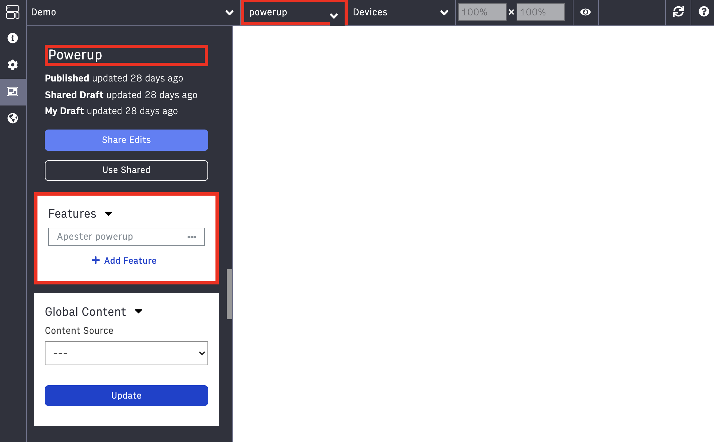
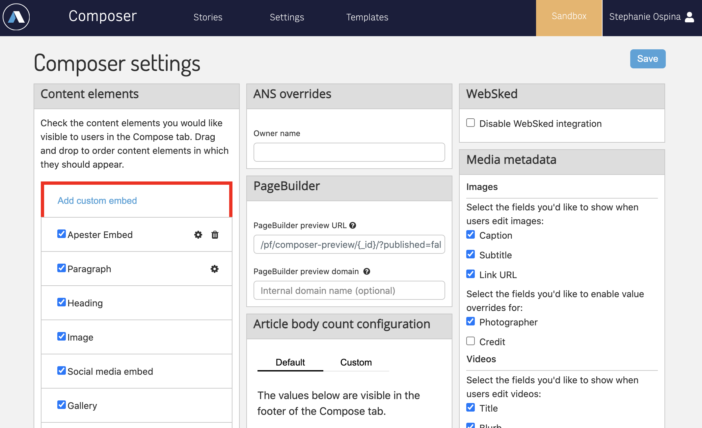
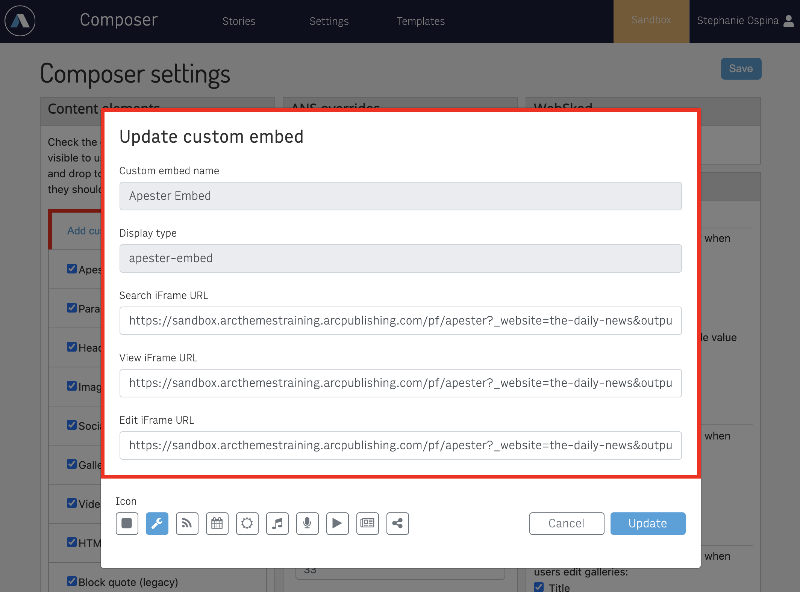
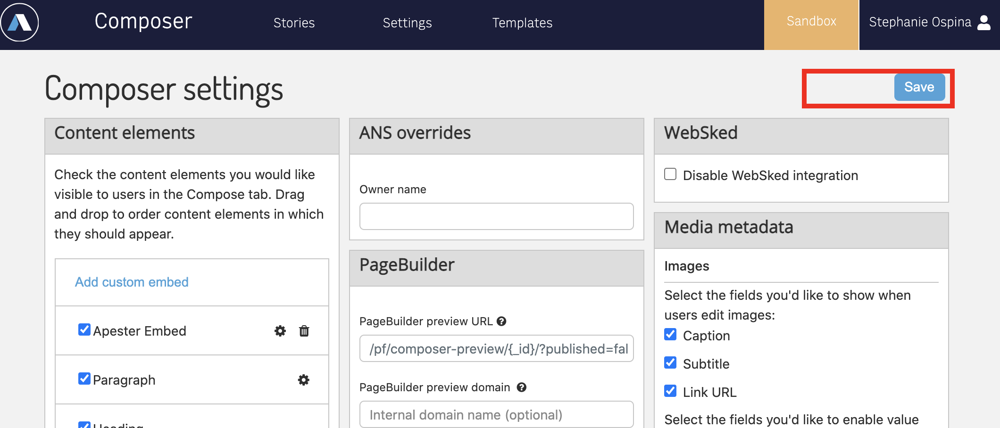
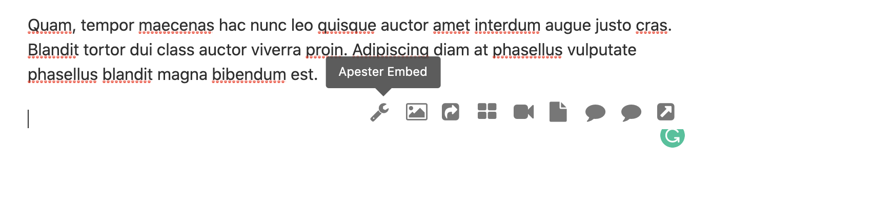
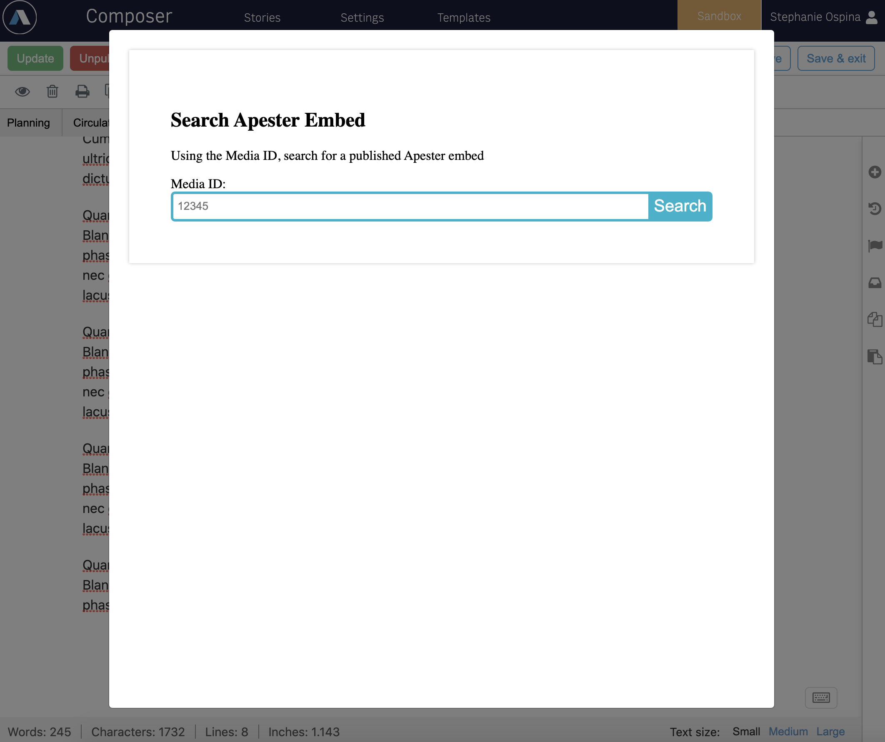
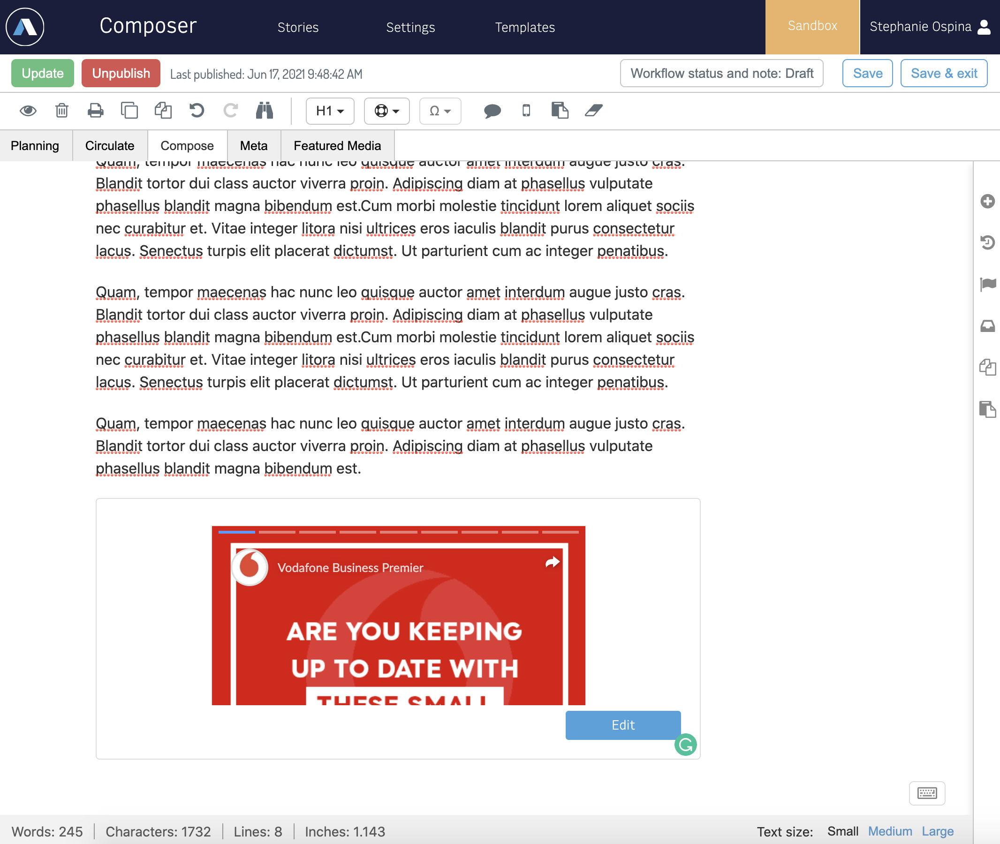
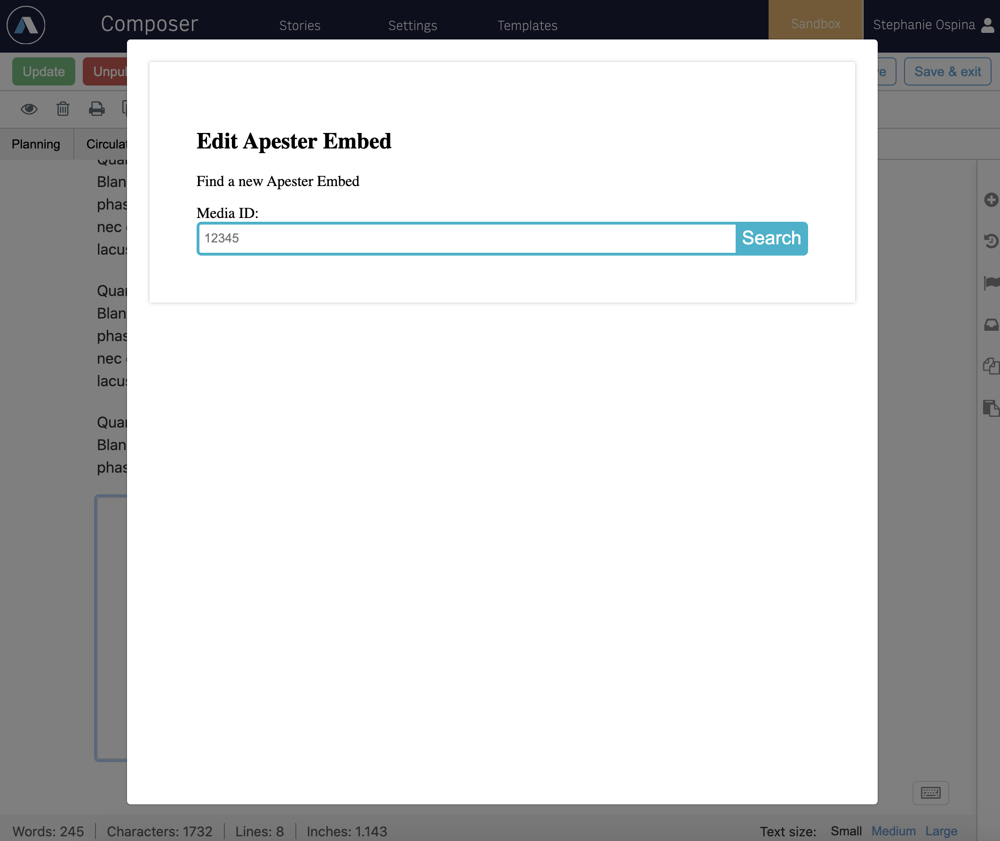

# Add the Composer settings

Before we add the Composer settings, create a page to host the Apester block in the environment where you deployed your code:

1. Go to `Page Builder` in the environment where you deployed your code (Sandbox or Development) and create a new page called Apester with the URI `apester`

3. Click on curate on the left menu

4. Click on `Add new feature`

5. Select `Apester Powerup` (If you don't see this option, make sure your code was successfully deployed)

6. On the top menu change the output-type to powerup

7. On the left menu click on the globe icon and click on `Share and Publish`

    

&nbsp;
## Now let's add the Composer Settings!
&nbsp;

1. Go to your organization's dashboard and make sure you're in the same environment where you deployed your code (Sandbox or Development)

2. Go to Composer and on the top menu click on `Settings`

3. Find the section that says `Content Elements`, you should see a button that says `Add custom embed`, click on it!

    

4. Let's add the following values:

    - Custom embed name: Apester Embed
    - Display type: apester-embed
    - Search iFrame URL: https://[your-organizations-url]/pf/[page-with-apester-block]?_website=[your-website]&outputType=powerup#SEARCH

    - View iFrame URL: https://[your-organizations-url]/pf/[page-with-apester-block]?_website=[your-website]&outputType=powerup#VIEW

    - Edit iFrame URL: https://[your-organizations-url]/pf/[page-with-apester-block]?_website=[your-website]&outputType=powerup#EDIT

    - Icon: select an icon for this Power-Up!

    &nbsp;

    ### Example:

    - Search iFrame URL: https://sandbox.arcthemestraining.arcpublishing.com/pf/apester?_website=the-daily-news&outputType=powerup#SEARCH
    - View iFrame URL: https://sandbox.arcthemestraining.arcpublishing.com/pf/apester?_website=the-daily-news&outputType=powerup#VIEW
    - Edit iFrame URL: https://sandbox.arcthemestraining.arcpublishing.com/pf/apester?_website=the-daily-news&outputType=powerup#EDIT

        

5. Click on `Add`

6. Important: Click on `Save!`

    

7. Go to a story in Composer and click on the body of the article, you should see a menu appear, find the icon for the Apester Power-Up and click on it!

    

8. If everything worked out well you should be seeing the SEARCH VIEW!

    

9. Search for your Apester Embed or use this one! `5dbe8444923548b36a17547b`

    

10. Once you select it, you can click on `Edit` to see the EDIT view!

    

## [Next up: Lab 11](https://github.com/arc-partners/Fusion-Training-User-Stories/tree/powerups-lab-11)
