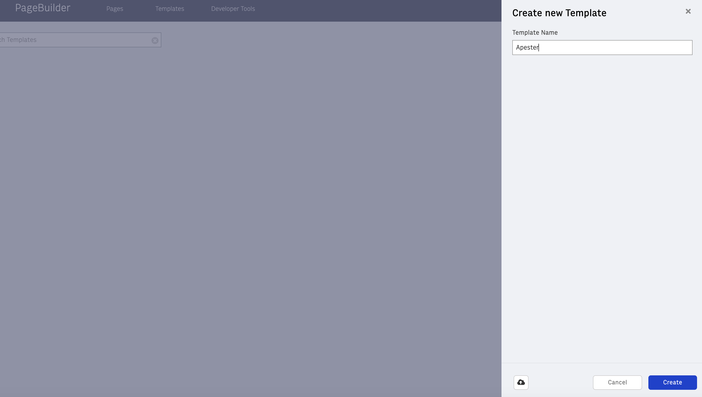
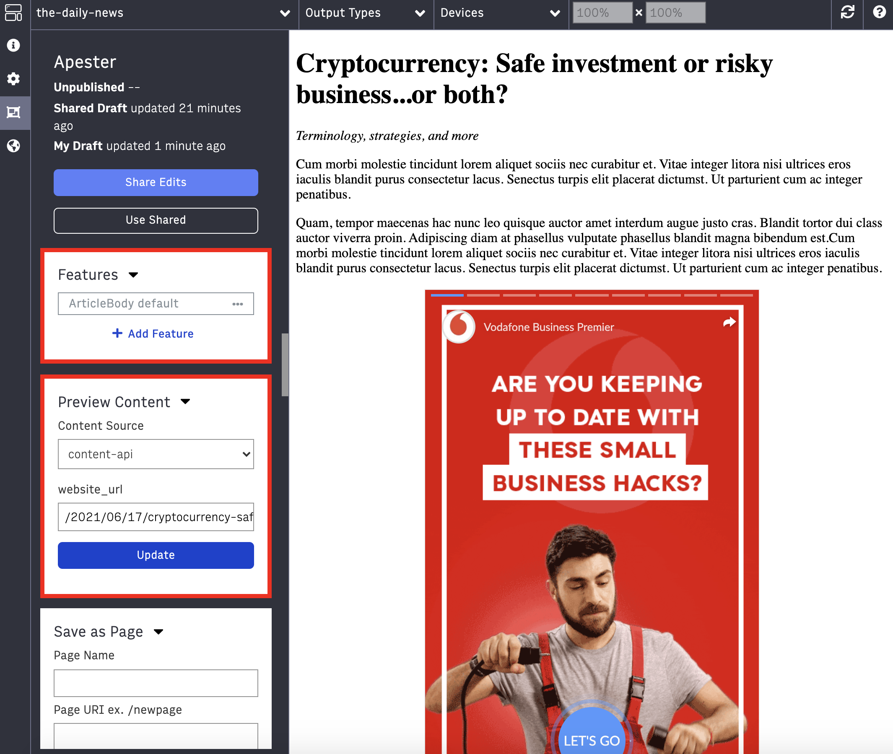
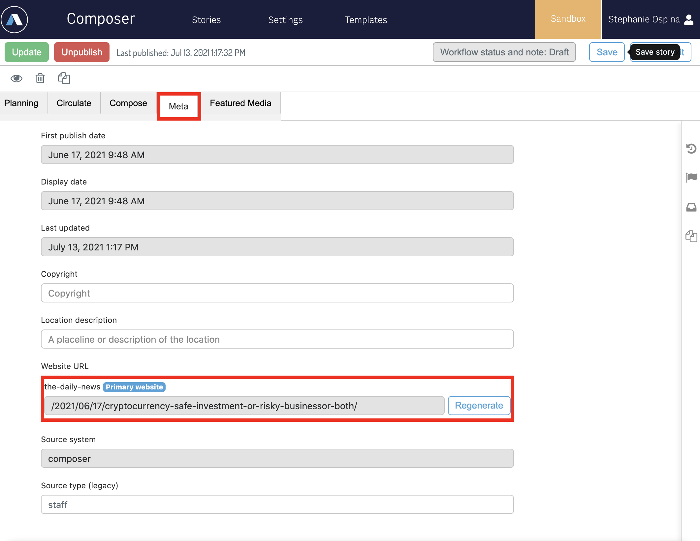
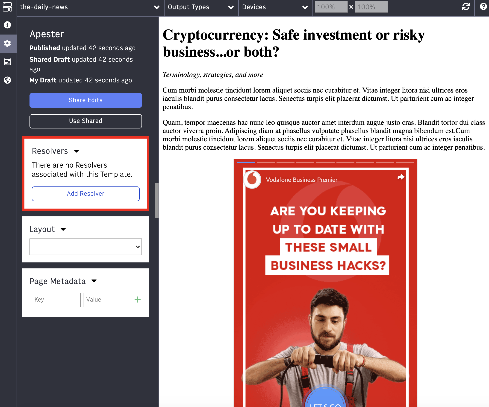
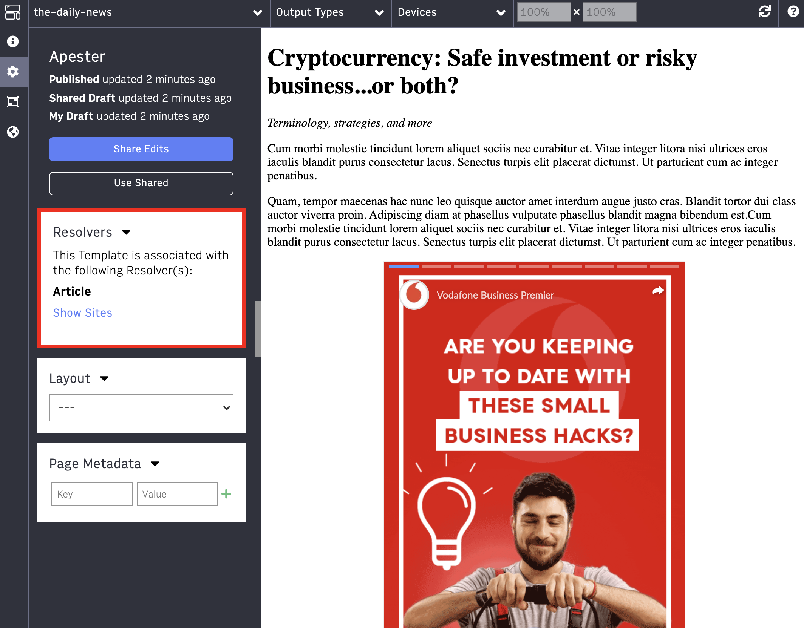
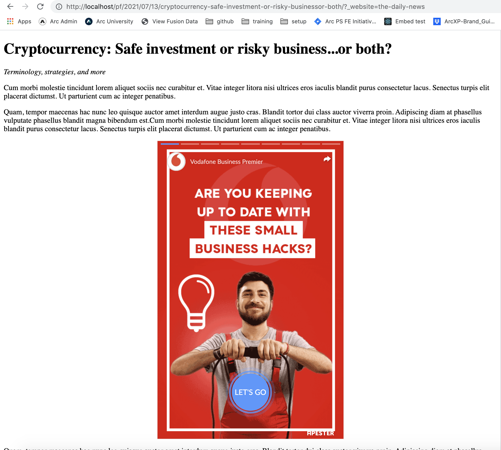

# Usage

Now that we have given editors the option to add an Apester embed in Composer, the embed config is now part of the ANS and we can access is it via useFusionContext()

## Getting the custom_embed from fusion context

As we have seen, all the content from Composer in the ANS have a different type e.g. 'text', 'image', etc. The type for Power-Ups is `custom_embed.`

Let's create a new Block to render the custom-embed in the article body:

1. Under features/ create a new folder called ApesterArticleBody and add a file called powerup.jsx

    ```
        components/features/ApesterArticleBody/powerup.jsx
    ```

2. the ApesterArticleBody looks very similar to the VIEW that we built in lab 06:

    ```
    import React, { useEffect } from 'react';
    import get from 'lodash.get';
    import propTypes from 'prop-types';

    const ApesterArticleBody = (props) => {
    useEffect(() => {
        const loader = document.createElement('script');
        loader.type = 'text/javascript';
        loader.src = 'https://static.apester.com/js/sdk/latest/apester-sdk.js';
        document.getElementsByTagName('head')[0].appendChild(loader);
    }, []);

    const mediaID = get(props, 'mediaId', null);

    return (
        mediaID ? <div className="apester-media" data-media-id={mediaID}>&nbsp;</div> : null
    );
    };

    ApesterArticleBody.propTypes = {
    mediaId: propTypes.string,
    };

    export default ApesterArticleBody;

    ```


Now if you have a feature for the article body, import the ApesterArticleBody and create a condition where if the content type from any of the elements equals `custom_embed` and the subtype equals apester, render the ApesterArticleBody.

If you don't have a block for the article body follow these steps:

1. Create a new feature called ArticleBody and a file called default.jsx

    ```
    /components/features/ArticleBody/default.jsx
    ```

2. Use useFusionContext() to get the content and map over each element. If the type is `custom_embed` we're going to return ApesterArticleBody

    ```
    import React, { Fragment } from 'react';
    import { useFusionContext } from 'fusion:context';
    import get from 'lodash.get';
    import ApesterArticleBody from '../ApesterArticleBody/powerup';

    const ArticleBody = () => {
        const { globalContent: item = {} } = useFusionContext();

        const parseElement = (element) => {
            const { _id: key = index, type, content } = element;

            switch (type) {
                case 'text' : {
                    return (
                        ( content.length > 0 && content !== '<br/>') ? <p>{ content }</p> : null
                    )
                }
                case 'image' : {
                    return (
                        <Fragment key={key}>
                            <div className='image'>
                                
                            </div>
                        </Fragment>
                    )
                }
                case 'custom_embed': {
                    const subType = get(element, 'subtype', '');
            
                    switch (subType) {
                    case 'apester-embed': {
                        return (
                        <ApesterArticleBody key={key} mediaId={get(element, 'embed.config.mediaId', '')}/>
                        );
                    }
                    default:
                        return null;
                    }
                }
            }
        }


        const renderArticle = () => {
            return item.content_elements.map(element => parseElement(element));
        }

        return (
            <div>
                <h1>{ item.headlines.basic }</h1>
                <i>{ item.subheadlines.basic }</i>

                { renderArticle() }
            </div>
        )
    }

    export default ArticleBody;
    ```
If you already have `content-api` go to the next step, otherwise:

1. Let's add a new file /content/sources called content-api.js

    ```
    content/sources/content-api.js
    ```

2. Let's add a resolve function that fetches article content 

    ```
    const schemaName = 'article';

    const params = {
        website_url : ''
    }

    const resolve = (key) => {
        const requestUri = `/content/v4/stories/?website_url=${key.website_url}&website=[your-website]`;
        return requestUri;
    }

    export default {
        resolve,
        params,
        schemaName
    }

    ```

3. A couple checks:

- Make sure you added your access token to the .env file (verify that it points to the right environment)

- Make sure that under `mocks/siteservice/api/v3` you have a mock with the id of your website:

    ```
    [
        {
            "_id": "YOUR_WEBSITE_ID",
            "display_name": "YOUR_WEBSITE",
            "is_default_website": true
        }
    ]


4. Once you completed your checks, re-start Fusion!

5. Once Fusion is running, create a new template called Apester

    

6. Under `Features` click on `Add Feature` and select the ArticleBody default block

7. Under Preview Content - Content Source select content-api:

    

    Under website-url enter the website url of the published story that has the Apester embed. To find the website URL go to the story in composer, click on the `Meta` tab and you should see an input that says `website URL` (if you don't see this, probably the story isn't published. Publish the story and try again)

    

8. Go back to Page Builder and check if you have a Resolver associated with the template

    

    If you do, move on to the next step, if you don't let's create one!

    - In Page Builder, under developer tools, click on `Resolvers` and click on `New Resolver`, add the Regex Pattern that matches your article's URL and select your template as the `Default Template`, then click on Save.

        

    - Go back to the template and now you should see the Resolver associated with the template:

        

8. Once we have the Resolver set up, let's go ahead and click on save and publish!

## End Result!

To see the published version of your story, go to the URL:

http://localhost/pf/[STORY-URL]?_website=[YOUR-WEBSITE]




